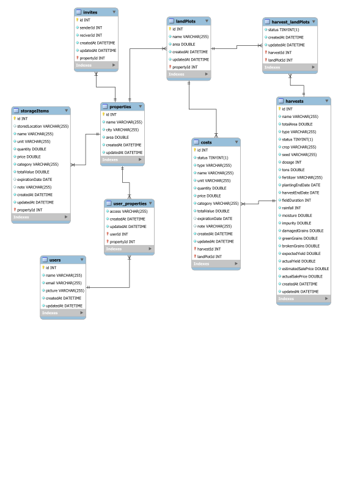
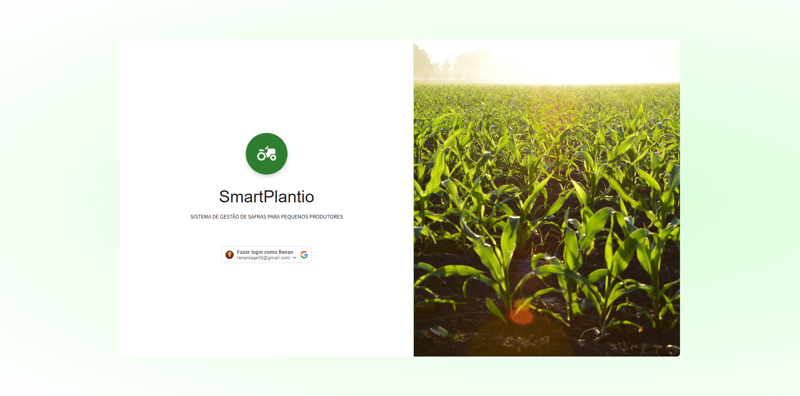
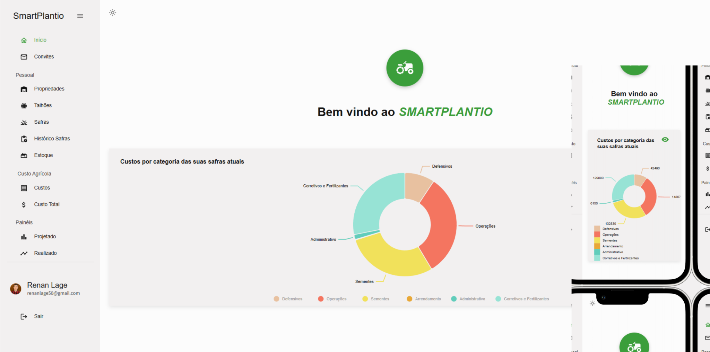
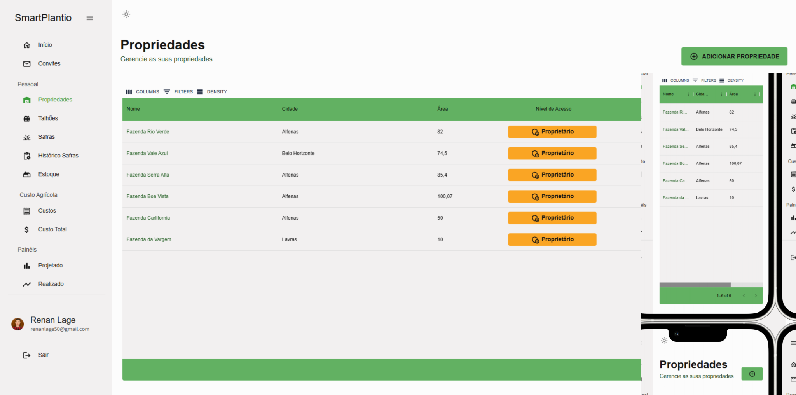
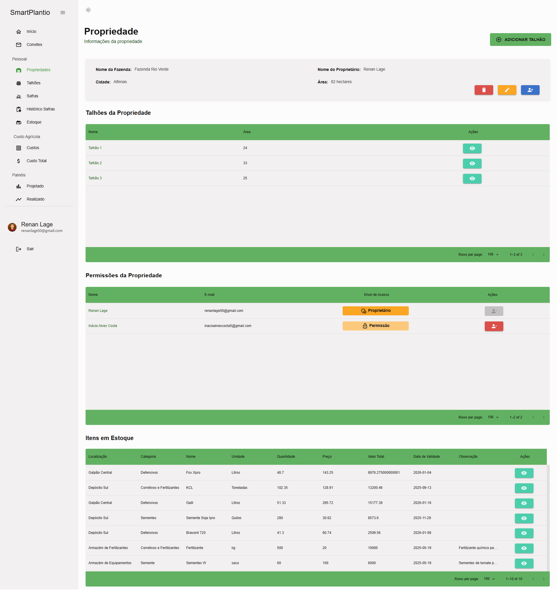
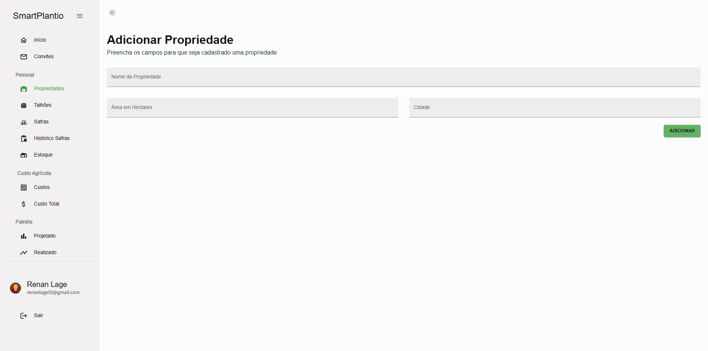
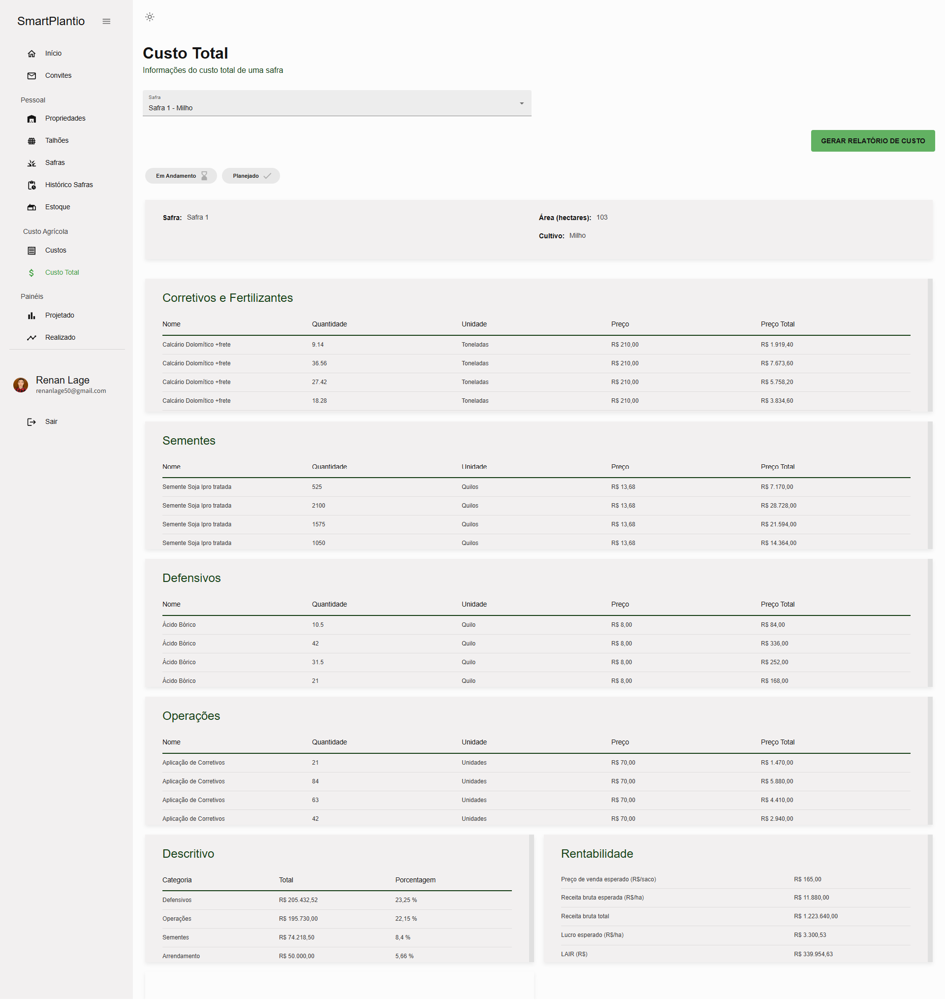
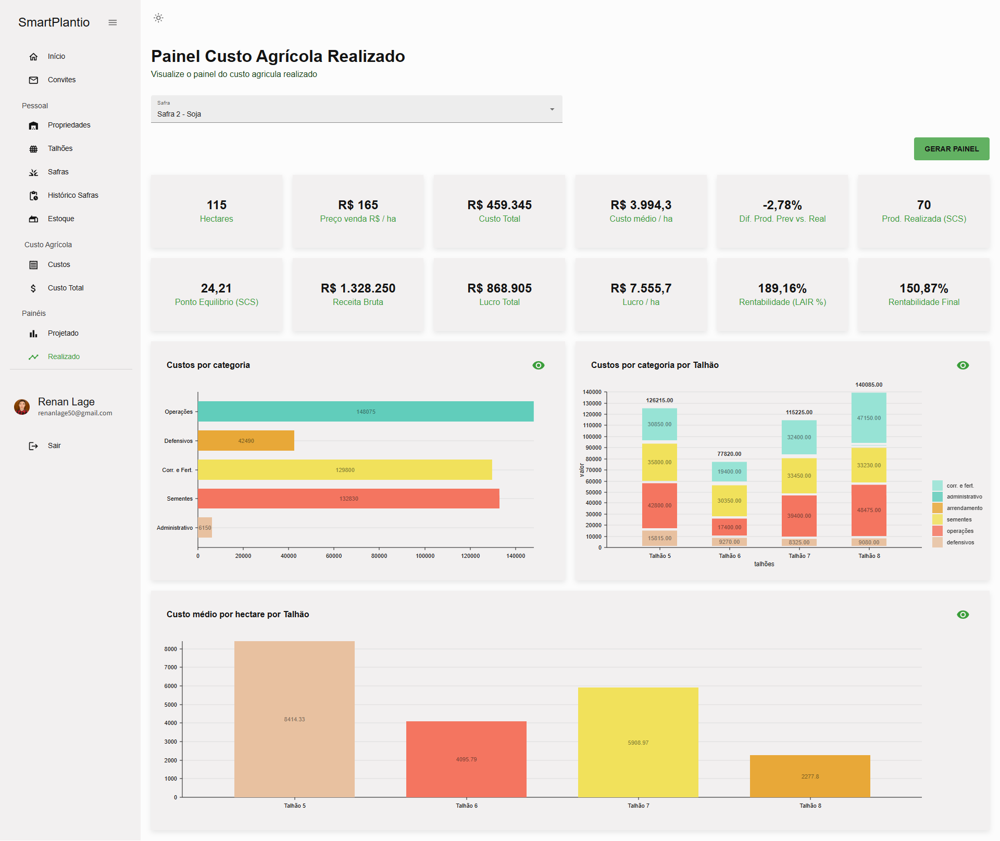

<div align="center">
  <h1> TCC - Trabalho de Conclusão de Curso </h1>
</div>

#### Universidade Federal de Alfenas - UNIFAL

RENAN MAGALHÃES LAGE 

<div align="center">
  <h3> SMARTPLANTIO: SISTEMA DE GESTÃO DE SAFRAS PARA PEQUENOS PRODUTORES </h3>

  
  
  
  
</div>

Este projeto é composto por:

- **Backend**: Node.js
- **Frontend**: React.js (Vite)
- **Banco de Dados**: MySQL
- **ORM**: Sequelize

---

## ✅ Funcionalidades do Sistema

- [x] Login com conta Google (Autenticação com OAuth 2.0)
- [x] Gerenciamento de propriedades (criar, editar, visualizar, deletar)
- [x] Gerenciamento de talhões (criar, editar, visualizar, deletar)
- [x] Gerenciamento de safras (criar, editar, visualizar, deletar)
- [x] Gerenciamento de custos (criar, editar, visualizar, deletar)
- [x] Gerenciamento de itens de estoque (criar, editar, visualizar, deletar)
- [x] Relatório de custos
- [x] Dashboard de safra (planejada e realizada)
- [x] Envio de convite de colaboração de uma propriedade
- [x] Responsividade (Adapta a diferentes tamanhos de telas)
- [x] Modo Escuro e Modo Claro

---

## 📁 Repositório

Clone o repositório:
```bash
https://github.com/RenanMagalhaesLage/TCC.git
```
Estrutura do repositório:
 ```bash
repositorio/
├── backend/
│   ├── index.js
│   ├── package.json
│   ├── package-lock.json
│   └── (outros arquivos e pastas do Node, como controllers, routes, middlewares.)
├── frontend/
│   ├── public/
│   ├── src/
│   │   ├── App.js
│   │   └── (componentes, páginas, etc.)
│   ├── package.json
│   └── (outros arquivos do React)
├── img/
│   └── (imagens usadas no projeto)
└── README.md

```

---

## 🔧 Backend (Node.js)

1. Abra o terminal e vá até a pasta raiz do backend:

```bash
cd backend
```
2. Instale as dependências
```bash
npm install
```
3. Rode a aplicação

```bash
nodemon index.js
```

---

## ⚛️ Frontend (React)

1. Abra o terminal e vá até a pasta raiz do backend

```bash
cd frontend
```
2. Instale as dependências
```bash
npm install
```
3. Rode o projeto
```bash
npm run dev
```
4. O projeto será iniciado em modo de desenvolvimento. Por padrão, o frontend estará disponível em:

👉 http://localhost:5173

(Essa porta é a padrão usada pelo Vite. Caso esteja ocupada, uma porta alternativa será exibida no terminal.)

---

## 🧩 Modelo Entidade Relacionamento do Banco de Dados


---

## 🖼️ Imagens do Projeto

Abaixo estão algumas capturas de tela que ilustram as principais funcionalidades do sistema:

### Tela de Login


### Tela inicial do sistema


### Tela de Listagem de Propriedades


### Tela de Visualização de Propriedade


### Tela de Cadastro de Propriedade


### Tela de Relatório de Custo


### Tela de Dashboard de safra 



